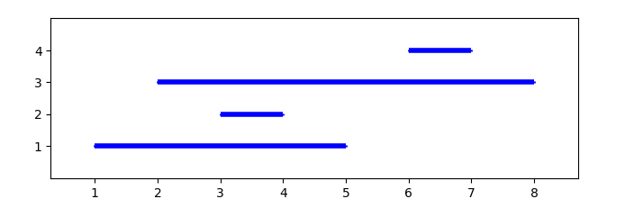

# [ParallelBatchImp](../../src/impl/ParallelBatchImp.cpp)
### Problem redefenition
In order to be able to compute anything in parallel one needs to make one big observation. When an element is being pushed and then popped we can view the push and pop time as the start and end of an interval. This interval being the time that the element was present in the queue. Then the question of finding the rank error of a pop operation can be translated into the question of finding how many other segments contain the segment associated with the pop operation. 

#### Example
Lets say we have the following operations:
```cpp
push(1)
push(3)
push(2)
pop(2) // rank = 2
pop(1) // rank = 0
push(4)
pop(4) // rank = 1
pop(3) // rank = 0
```
Now if we would draw these as intervals, with time as the x-axis and value on the y-axis it would look like this:


Now if we look at the interval associated with the element `2` we can se that it starts at time `3` and ends at time `4`. This means that it is contained by both the interval for element `1` and `3` hence the rank error is 2.

### Subproblems
With the problem redefenition we can now split up the problem into sub problems that we can know wont affect each other, hence they can be run in parallel! The question is how do we do this. 

Lets use te same example and say we want to split the problem into two subproblems. This can probably be done in several ways but we have looked into two ways. The first being splitting the total time window in half. If we do this to our example we will get a split time stamp of `4`. With this split time thread 1 (t1) will have a start time of 1 and an end time of 4, and thread 2 (t2) will have start time of 4 and end time of 8. 

In order for both threads to calculate the correct errors we need to bve careful when deciding what intervals should be included in each subproblem. t1 obvously has to know about intervals 1, 2 and 3, however t2 has to know about 3 and 4. Since if t2 didnt know about 3 it would calculate the incorrect rank error for interval 4. Furthermore only one of the thread should calculate the error of interval 3, since if it had an error we dont want to calculate it twice since that would impact the total mean error. So here we decide the rule: threads only calculate the errors of intervals with a starting point within their time window. So the split up for each thread goes like this:
```cpp
for(auto interval : intervals){
    // interval start before timwe windoe but ends after window start, so it can impact rank errors
    if(interval.start < time_window.start && interval.end >= time_window.start){
        subproblem.non_counting_intervals.push_back(interval);
    // interval starts within time window and should be calculated 
    } else if(interval.start >= time_window.start && interval.start < time_window.end){
        subproblem.intervals.push_back(interval);
    }
}
```
This is a simplification of the actual [implementation](../../src/impl/ParallelBatchImp.cpp), but it will achieve the same split up. Our actual implementation takes the approach to only look at each interval once and figures out what threads needs to know about what intervals. 


Another way of finding the split points is to give each time window roughly the same ammount of starting intervals within them. Then when the start and end times for the windows are found the same split up logic can be done. 

Then finally we can run whatever implementation we want on each subproblem, as long as we keep track of the sum and the maximum error for each sub problem we can correctly calculate the mean and maximum of the entire problem.

One optimization that can done is introducing constant errors for a thread. This is the case when we have intervals that start before the `time_window.start` and does not have and ent time, ie it was never popped. 
